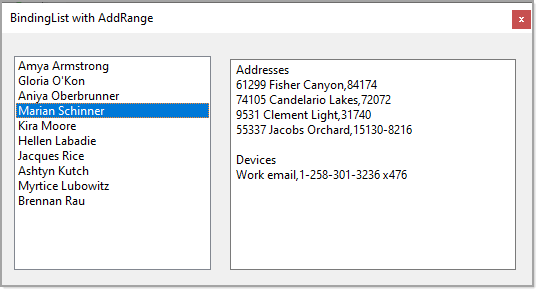

# About

Example for using `BindingListSpecial.AddRange` method.

# Mocked data

:small_blue_diamond: [Bogus](https://github.com/bchavez/Bogus) NuGet package is used to populate data for this example.