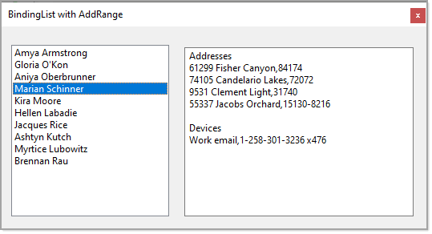

# About

A BindingList with AddRange which is for keeping business code clean, eliminate using a conventional foreach to add items to the component.

## Sample


See the project `BindingListExample` for usage.



```csharp
using System;
using System.Linq;
using System.Text;
using System.Windows.Forms;
using BindingListExample.Classes;
using BindingListExample.Models;
using BindingListLibrary;

namespace BindingListExample
{
    public partial class Form1 : Form
    {
        private BindingListSpecial<Person> _bindingList;

        public Form1()
        {
            InitializeComponent();

            Shown += OnShown;
        }

        private void OnShown(object sender, EventArgs e)
        {
            var list = BogusOperations.PeopleList(10);

            _bindingList = new BindingListSpecial<Person>(list.Take(5).ToList());

            PeopleListBox.DataSource = _bindingList;

            _bindingList.AddRange(list.Skip(5).Take(5).ToList());

            PeopleListBox.SelectedIndexChanged += PeopleListBoxOnSelectedIndexChanged;
            ShowPersonInformation();
        }

        private void PeopleListBoxOnSelectedIndexChanged(object? sender, EventArgs e)
        {
            ShowPersonInformation();
        }

        private void ShowPersonInformation()
        {
            StringBuilder builder = new();
            Person person = (Person)PeopleListBox.SelectedItem;

            builder.AppendLine("Addresses");
            foreach (var address in person.Addresses)
            {
                builder.AppendLine($"{address.Street},{address.PostalCode}");
            }

            builder.AppendLine("");
            builder.AppendLine("Devices");

            foreach (var device in person.ContactDevices)
            {
                builder.AppendLine($"{device.DeviceType},{device.Value}");
            }

            PersonTextBox.Text = builder.ToString();
        }

    }
}

```